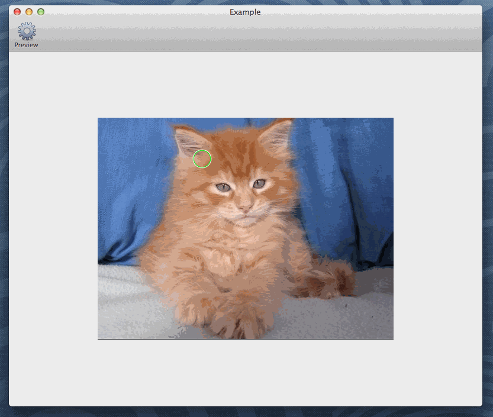
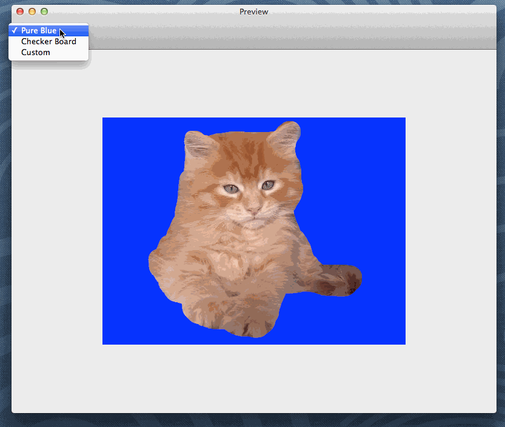

# VMBrushImageView
Brush foreground and background on a NSImageView.

## What It Is and What It Isn't
`VMBrushImageView` is intended to work as a view component for interactive image segmentation, which keeps track of user scribbles and generate corresponding mask with it.

`VMBrushImageView` is not a set of interactive image segmentation. You will find zero lines of code on image segmentation algorithm. But you can easily develope && integrate your own algorithm.

## Demo
`VMBrushImageView` provides 3 types of brushes, namely: `Foreground (Green)`, `Background (Red)` and `Eraser (Clear)`.

Of course, it is possible to change brush size and reset the whole mask:

And, the most important part, it is quite easy to use the mask generated from `VMBrushImageView` with other images:

## Dependency
`VMBrushImageView` works with OS X version >= 10.8 (I didn't test it with 10.7 or prior, so if it works, please let me know). 

The Example project works for OS X version >= 10.9 only since I've used `CIBlendWithAlphaMask` which comes with 10.9.

## Setup
To setup for your project, copy the classes from `VMBrushImageView` folder to your project and you are all set.

<b>Note:</b>you may have noticed the `NSImage+BitmapRep` category, it is a quite common helper class. So if you happen to have one in your project, feel free to get rid of my implementation. Or, even better, if you would like to share with me your implementation, please send a pull request.

## Create View
You can drag an instance of `NSImageView` from Interface Builder and set the class to `VMBrushImageView`. You can also embed this view inside a `NSScrollView`.

## Setup View
You can set initial brush size and brush type with `brushRadius` and `brushType` properties of `VMBrushImageView`. You can also set max and min brush radius with `maxBrushRadius` and `minBrushRadius`.

Even though `VMBrushImageView` inhreits from `NSImageView`, <b>DO NOT</b> use `setImage:` to set the raw image. Instead use `setRawImage:`, where `VMBrushImageView` can initialize some variables and get ready for future work.

## Integrate Your Own Segmentation Algorithm
`VMBrushImageView` is inteded for scribble-based interactive image segmentation, but it doesn't have any code to compute the segmentation. It's a whole new story, and is not the part of the view.

With that stated, you can easily integrate your algorithm by calling `setMaskOperation:triggerDuringMove:`.

The first parameter is a block that takes two `NSImage`s (source image and user scribble image), and returns a computed mask, which is also a `NSImage`.

The second parameter is a `BOOL` value indicating whether the computation should be performed while user is dragging mouse (YES), or only when user has let go mouse (NO).

## Get Final Mask
`VMBrushImageView` gives you the result of the mask with `-(NSImage *)outMask`. The image is preprocessed with `CIMaskToAlpha` which means you can make use of alpha value of the image directly. Please check the Example project on how you can leverage this mask image.

## Example Project
The Example project in `Example` folder is intended to show you how to use `VMBrushImageView`, it is not fully tested, nor optimized.

To see how you can create and setup the view, please check `MainMenu.xib` and `VMAppDelegate.m`. To see how you can leverage `outMask`, please check out `VMPreviewWindowController.m`.

## Licence
Please read [LICENCE](./LICENCE).

## Known issue
- Unable to customize cursor image
- Cursor not showing up when first launch
- Blend-while-scribbling is slow